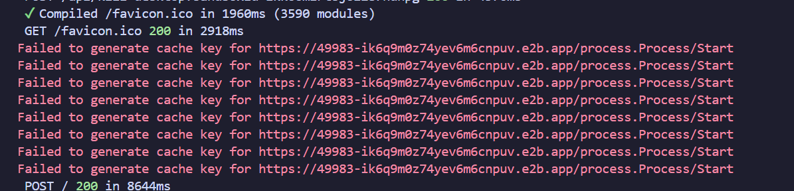
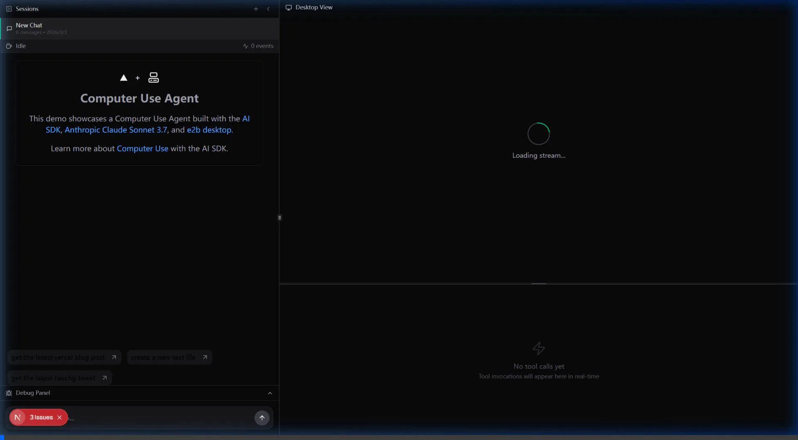

作者 ：XuBiao

<h1 align="center">AI SDK Computer Use Demo</h1>
</a>

Author：XuBiao

Currently, due to my location in China and the network environment I am in, some foreign API interfaces cannot be requested normally; therefore, session requests cannot be made; and dialog operations on the computer cannot be completed
The error reported is as shown below:

Implemented required functions:

1. Two-Panel Layout
   Reorganize the interface into a two-panel layout:Left Panel:
   · Chat interface with streaming messages
   Inline tool call visualizations
   Collapsible debug/event panel at the bottom
   Right Panel:
   VNC viewer (existing functionality, must remain working)
   Expanded tool call details (when a tool call is clicked from the left panel)Layout Specifications:
   Panels must be horizontally resizable
   Must support desktop and tablet viewports
   Maintain visual hierarchy and usability
2. Responsive layout for phone viewports

Currently, the video only demonstrates the required functions as follows:

Here is the gif：

